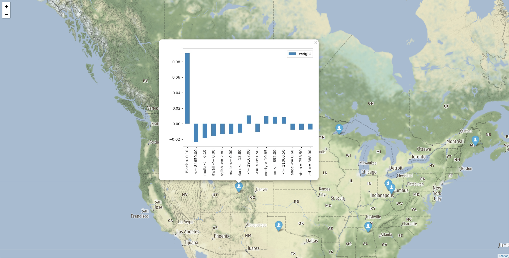

# Exmap

[](https://zenodo.org/badge/latestdoi/179990140)

## Description

Exmap is a Python package with allows users to generate maps based on an interpretable machine learning prediction. The current version of the package supports interpretation of the popular gradient boosting algorithm implementation [XGBoost](https://xgboost.readthedocs.io).

The interpretations under the hood are achieved by using [LIME](https://github.com/marcotcr/lime), and the maps are generated by using [Folium](https://github.com/python-visualization/folium) (a Python based wrapper for Leaflet.js).

Such maps help you dive deeper and explore more detailed patterns in your spatial datasets, which you would otherwise miss by just focusing on the model performance results. An individual observation might have the same predicted class or value as another one, but the results can be very different. We can use elections as a metaphor: people would vote for the same candidate, but for different reasons.

Below you can have a look at am example generated map (based on the 2016 US Elections):



## Installation instructions

After cloning the repository:

```bash
pip install .
```

## Generating a map

As a first step we need to train a machine learning classifier.

```python
from exmap import Exmap
import pandas as pd

voting_data = pd.read_csv("sample_data/voting_data.csv")
X = voting_data.drop('Clinton', axis=1)
y = voting_data['Clinton']
targets_limit = 10

X_test, test_coords, explainer, model = Exmap.train_model(features=X, target=y, task_type="clf")
```

After this we can compute the individual LIME explanations.

```python
explanations = Exmap.compute_lime_explanations(test_data=X_test, explainer=explainer, model=model, targets_limit=targets_limit, num_features=15, task_type="clf")
```

Then we can use those LIME explanations to create plots, stored in the `images` folder (make sure you have created this folder beforehand, otherwise you will get an error).

```python
Exmap.generate_lime_plots(explanations_list=explanations, image_prefix="voting")
```

And as a final step we use those static plots (as a `.png` format) as tooltips for the Folium map, which we export as `.html`.

```python
m = Exmap.make_map(test_coords=test_coords, targets_number=targets_limit)
m.save('voting_map.html')
```

In the end you can open this map in any browser and explore the results.
